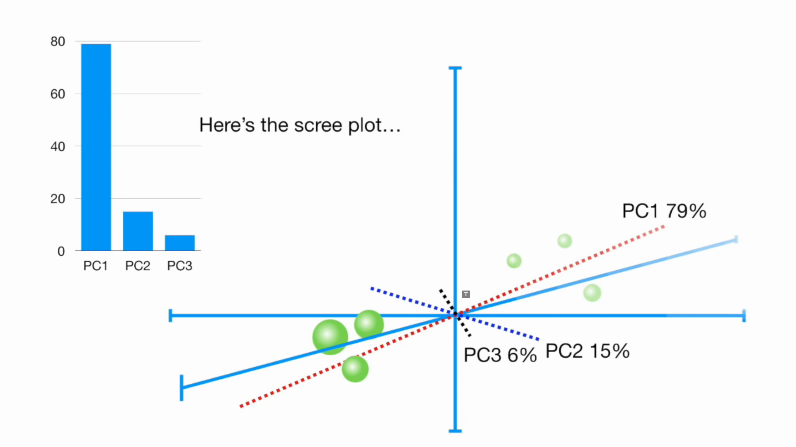
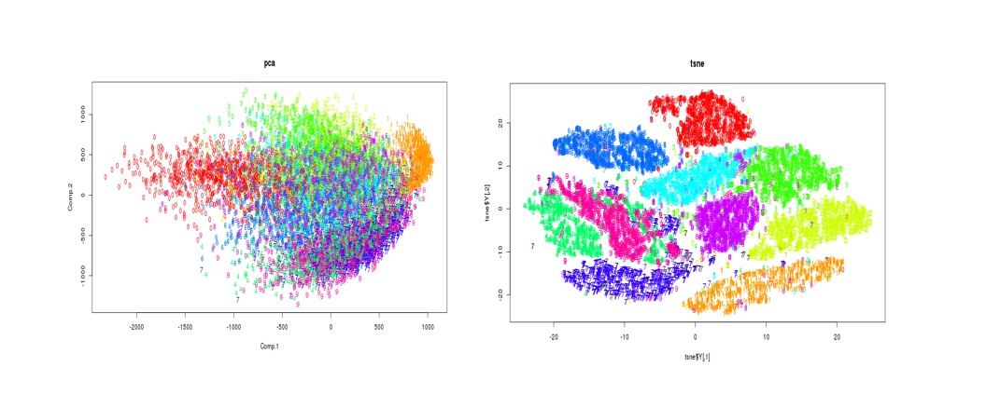
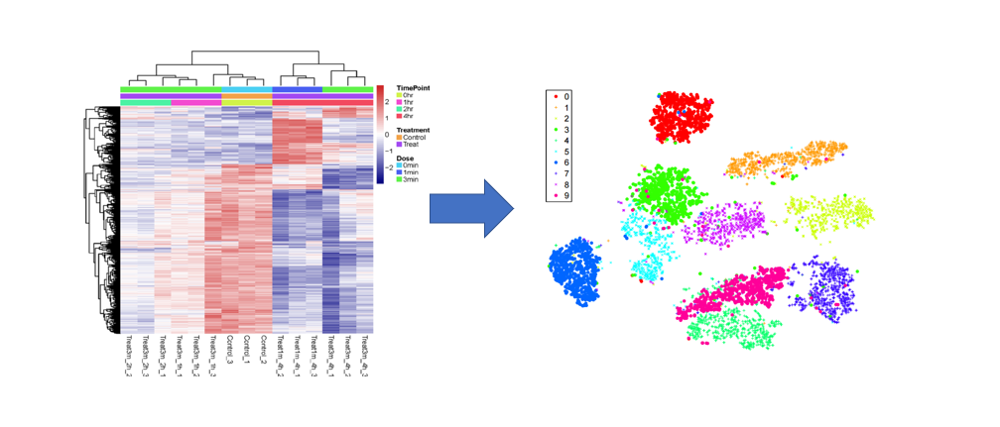
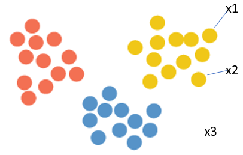
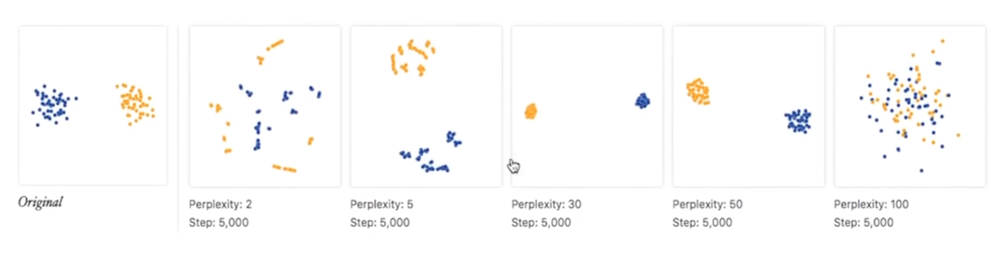
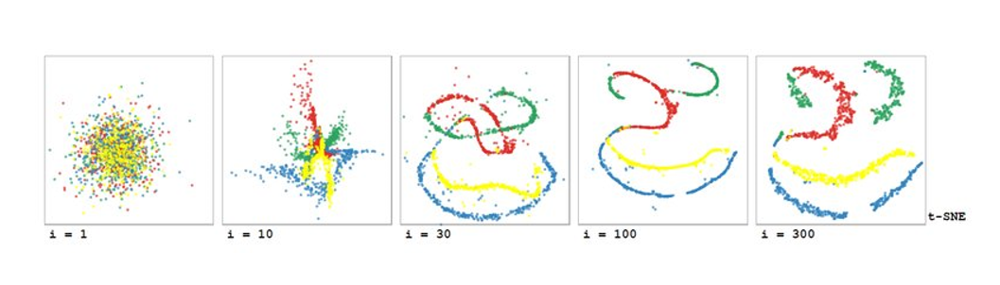
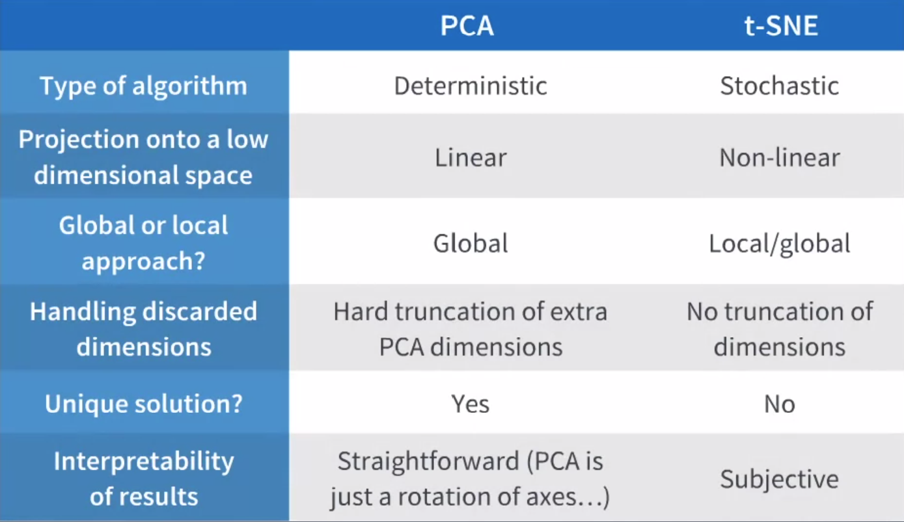

# Machine Learning – Dimension Reduction (PCA & t-SNE)

## Author: Xin Xu, Group 2

## 1. Introduction
When we get a expression matrix from RNA-seq, in which every row is a gene, and every column is a sample, how should we get a general sense of the distribution of the data and how can we know which genes are more important for the expression matrix? 

Take this table as an example. We have the expression level of 4 genes for 6 samples. Since each gene represents one dimension, this table is in the 4 dimentional space. If we want to visualize the entire data table directly, it would be impossible because human beings can only understand plots in 2D or 3D. 

|      |Mouse 1|Mouse 2|Mouse 3|Mouse 4|Mouse 5|Mouse 6|
|------|-------|-------|-------|-------|-------|-------|
|Gene 1|  10   |  11   |   8   |   3   |   2   |   1   |
|Gene 2|  6    |   4   |   5   |   3   |  2.8  |    1  |
|Gene 3|  12   |   9   |   10  |   2.5 |   1.3 |  2    |
|Gene 4|   5   |   7   |    6  |   2   |     4 |   7   |
[1]

In addition, there are an estimated 19,000-20,000 human protein-coding genes, in another word, the expression matrices we get from human samples are easily in 20,000 dimensional space. So it is essential to have some techiniques that can reduce the dimension of the data while retaining important information within the data. Luckily for us, dimensionality reduction techniques such as PCA and t-SNE can map the original data in high dimensional space to lower dimension while retaining some spatial information. With these techiniques, we can easily visualize the data in 2D or 3D space, and reduce the computational burden for downstream analyses with a smaller dataset.

## 2. PCA: Principle Components Analysis

Principal Components Analysis (PCA) is one of the most common dimensionality reduction methods. It produces a set of linearly uncorrelated variables called principal components, and transform the data from original space to these principle components. The first component is determined by its contribution to the greatest variance in the data. Then all subsequent components are found by the same greatest-variability constraint, while also being orthogonal to the previous one. [1] 

Mathematically, PCA works by computing eigenvectors and eigenvalues of the data matrix, but to demonstrate intuitively the mechanism, we will use visualization of points in Cartesian coordinate system for a walk through.

### PCA analysis for 2 genes (2D)

Let’s take a expression matrix mentioned earlier with 6 mouse samples as an example. To begin with, we will demonstrate how PCA works with only gene 1 and gene 2 from the expression matrix. 
    

1. We start with finding the center of all the points, and move all data points so that the center is located at the origin of the coordinate. 

2. Then PCA calculates the first principal component with the highest variations in the data. What it does is to first fit a line to the data set similar to linear regression. For an arbitrary line in the plane, the sum of squared distances to the projections of all the points are calculated and minimized. This has the same effect as minimizing all the distances between the points and the line (Hint: Pythagorean theorem).

3. After we get PC1, PC2 is simply the line that goes through origin and is perpendicular to PC1.

4. For the example of 2 genes, the principle component analysis is now done. We will then remap all the data points using PC1 as the x axis and PC2 as y axis. And we can see from the last image that PC1 covers 83% of variances and PC2 17% of vairances of all data points.

### PCA analysis for 3 genes (3D)

We have shown the mechanism of PCA for 2D space, but PCA is mostly useful for dimension reduction of high dimentional data. For expression matrix, we can get more thousands of the genes (each gene is one dimension), but luckily the analysis mechanism is still the same. Here we just use 3 genes for illustration.

1. As shown in the previous section, we move the origin to the center of all points, and the PC1 that capture the most variance is found in the 3D space.

2. We then find PC2 in the plane orthognal to PC1 which also goes throgh the origin. PC2 captures the most variance in this orthognal plane space. 

3. Since we start off with 3D space, PC3 is already determined after finding PC1 and PC2. It is the line that is perpendicular to both PC1 and PC2.

### Feature selection using PCA

Besides visualization of high dimensional data in low dimensional space. PCA is also wildly used for feature selections to reduce the downstream analysis burden, or to simply find out what genes contribute to the most variances among the samples. 

| Genes|Importance|
|------|----------|
|Gene 1|  0.61    |
|Gene 2|  0.08    |  
|Gene 3|  0.23    | 
|Gene 4|  0.08    |  

After PCA, we could get the "importance" values of each gene based on how each principle component is derived. In this table (values are arbitrary just for demonstration), we can see that gene 1 and gene 3 together covers more than 80% of the variances. We know these two genes contribute to the most differences among the 6 mouse samples. And we can discard gene 2 and gene 4 if we want a smaller set for downstream analysis.

## 3. t-SNE: t-distributed Stochastic Neighbor Embedding

tSNE (t-distribution stochastic neighborhood embedding) is a dimensional reduction and visualization technique that usually reduce high dimensional data to a 2D plot to represent and visualize the structure of the original structure. But why do we need to trouble ourselves if PCA is good enough for the dimension reduction task? It turns out that PCA only preserves global structure of the data points and may lose information such as subgroup information. Here we use an arbitrary exmaple for illustration. 

Suppose each color indicates the inner structures among data points (for example, cell types in the single cell RNA-seq experiments). We can see that PCA tends to plots all the points together. If we don't have the color information before hand, it would be impossible to see the subgroups. But in the t-SNE plot, different colors are group into different clusters nicely. With this illustration, we can see that t-SNE is suitable for observing sub-structures of the dataset, and in reality it is often used in the single cell RNA-seq for visualization of cell types. 

### How does t-SNE works in general

Since t-SNE uses a complex stochastic neighborhood embedding formula, we would not go into detail of its mechanism. But in general, t-SNE only preserves distances between neighbouring points truthfully, and the distances between points from different neighborhood are not preserved. Take the following image as example, only distance between x1 and x2 are preserved, and distance between x1 and x3 and the distance between x2 and x3 are not preserved. 

In this way, during the dimension reduction process, the points in the same neighborhood will be transformed in a similar fashion, and still be close to each other in the final 2D visualization.

### Hyperparameters for tSNE

Different from PCA, t-SNE analysis has some hyperparameters that are human inputs. Here we will introduce two most important hyperparameters: perplexity and number of iterations, which greatly affect the look of the final 2D plot.

#### (1) Perplexity

Perplexisty represents roughly the number of potential neighbors considered for a cluster. In the figure below, we can see that as the chosen perplexity changes, the plot looks drastically different, and in this case perplexity equals to 30 to 50 renders the best plot because the differen colors are clearly separated to different groups. 

This reminds us to try different perplexity parameters until a reasonable and clear clustering is visualized by t-SNE. It also warns us against relying on t-SNE for unsupervised clustering, because the end clusters might not be reliable, as shown in the plots of perplexity 2.

#### (2) Number of iterations

Since there is always some stochasticity in tSNE’s embedding, we need to run multiple iterations to improve it. As shown in the image below, the embedding improves, with some randomness, from iteration to iteration. And with only a few iterations (from 1 to 30) t-SNE results do not converge, but with more iterations (100 to 300), the plots stablizes. 

## 4. Comparison

PCA has the advantages of definite results and fast run time. It is often used in the earlier stage data analysis step to extract important features (genes) for downstream analysis. And since the resulting principle components are linear combinations of original data, the results can be relatively well interpreted. However, as a data visualization method, it often suffers from the “crowding problem”,in which the somewhat similar points in the high dimensional space collapses in 2D space. For data with many outliers, the non-outliers are force to collapse together and the information for the internal variations among the non-outliers is lost in the process. 

In contrast, t-SNE is computationally expensive and take several hours on million-sample datasets. It is non-deterministic, different run would renter different results, and by providing different perplexity, the resulting clusters would change dramatically. But, as a visualization method, it can relatively show the internal structures of the data well since it preserves the local neighborhood information of the original data in high-dimensional space.

PCA and t-SNE both have advantages and disadvantages. Because of their different focuses, people often apply them in combination for different purposes. PCA is often used to derive the most important features (genes) from the data and make the dataset smaller. And t-SNE is often applied to the filtered dataset for visualization. 

Note that PCA and t-SNE are only two popular dimension reduction methods. There are many more state-of-the-art methods better serving this purpose, such as ICA and UMAP. 

## Reference

[1]https://www.youtube.com/watch?v=FgakZw6K1QQ)
[1]https://blog.treasuredata.com/blog/2016/03/25/dimensionality-reduction-techniques-where-to-begin/
https://www.biostars.org/p/295174/
http://www.jmlr.org/papers/volume9/vandermaaten08a/vandermaaten08a.pdf
https://www.coursera.org/lecture/fundamentals-machine-learning-in-finance/dimension-reduction-with-tsne-JTUfK 

