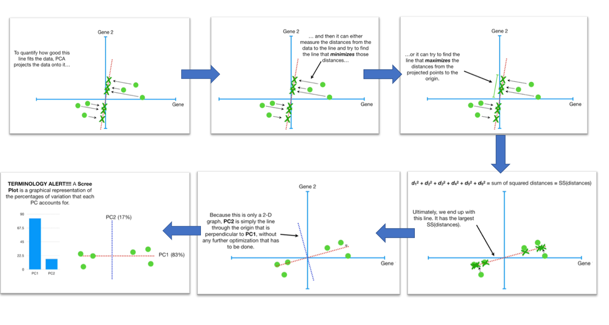

# Machine Learning – Dimension Reduction (PCA & t-SNE)

## Introduction
When we get a expression matrix from RNA-seq, in which every row is a gene, and every column is a sample, how should we get a general sense of the distribution of the data and how can we know which genes are more important for the expression matrix? 

Take this table as an example. We have the expression level of 4 genes for 6 samples. Since each gene represents one dimension, this table is in the 4 dimentional space. If we want to visualize the entire data table directly, it would be impossible because human beings can only understand plots in 2D or 3D. 

|      |Mouse 1|Mouse 2|Mouse 3|Mouse 4|Mouse 5|Mouse 6|
|------|-------|-------|-------|-------|-------|-------|
|Gene 1|  10   |  11   |   8   |   3   |   2   |   1   |
|Gene 2|  6    |   4   |   5   |   3   |  2.8  |    1  |
|Gene 3|  12   |   9   |   10  |   2.5 |   1.3 |  2    |
|Gene 4|   5   |   7   |    6  |   2   |     4 |   7   |

In addition, there are an estimated 19,000-20,000 human protein-coding genes, in another word, the expression matrices we get from human samples are easily in 20,000 dimensional space. So it is essential to have some techiniques that can reduce the dimension of the data while retaining important information within the data. Luckily for us, dimensionality reduction techniques such as PCA and t-SNE can map the original data in high dimensional space to lower dimension while retaining some spatial information. With these techiniques, we can easily visualize the data in 2D or 3D space, and reduce the computational burden for downstream analyses with a smaller dataset.

## PCA: Principle Components Analysis

Principal Components Analysis (PCA) is one of the most common dimensionality reduction methods. It produces a set of linearly uncorrelated variables called principal components, and transform the data from original space to these principle components. The first component is determined by its contribution to the greatest variance in the data. Then all subsequent components are found by the same greatest-variability constraint, while also being orthogonal to the previous one. [1] 

Mathematically, PCA works by computing eigenvectors and eigenvalues of the data matrix, but to demonstrate intuitively the mechanism, we will use visualization of points in Cartesian coordinate system for a walk through.

### PCA analysis for 2 genes (2D)

Let’s take a expression matrix mentioned earlier with 6 mouse samples as an example. To begin with, we will demonstrate how PCA works with only gene 1 and gene 2 from the expression matrix. 

1. The data set is first moved so that its center is at origin. Then PCA calculates the top components with the highest variations in the data. What it does is to first fit a line to the data set similar to linear regression. For an arbitrary line in the plane, the (sum of squared) distances to the projections of all the points are calculated and minimized. This has the same effect as minimizing all the distances between the points and the line (Hint: Pythagorean theorem).    

2. The data set is first moved so that its center is at origin. Then PCA calculates the top components with the highest variations in the data. What it does is to first fit a line to the data set similar to linear regression. For an arbitrary line in the plane, the (sum of squared) distances to the projections of all the points are calculated and minimized. This has the same effect as minimizing all the distances between the points and the line (Hint: Pythagorean theorem).

3. From the resulting line, we also know what the compositions of PC1 are based on its slope: it contains 4 parts Gene1 plus 1 part Gene2.
4. PC2 is simply the line perpendicular to PC1. If the data is in 3D, PC2 will be residing in a plane perpendicular to PC1, and the previous steps will be repeated.
5. Usually we can also know the percentage of total variations explained by each PC. It is often plotted as s Scree plot.

## t-SNE: t-distributed Stochastic Neighbor Embedding

## Comparison

PCA has the advantages of definite results and fast run time. It is often used in the earlier stage data analysis step to extract important features (genes) for downstream analysis. And since the resulting principle components are linear combinations of original data, the results can be relatively well interpreted. However, as a data visualization method, it often suffers from the “crowding problem”,in which the somewhat similar points in the high dimensional space collapses in 2D space. For data with many outliers, the non-outliers are force to collapse together and the information for the internal variations among the non-outliers is lost in the process. 

In contrast, t-SNE is computationally expensive and take several hours on million-sample datasets. It is non-deterministic, different run would renter different results, and by providing different perplexity, the resulting clusters would change dramatically. But, as a visualization method, it can relatively show the internal structures of the data well since it preserves the local neighborhood information of the original data in high-dimensional space.

PCA and t-SNE both have advantages and disadvantages. Because of their different focuses, people often apply them in combination for different purposes. PCA is often used to derive the most important features (genes) from the data and make the dataset smaller. And t-SNE is often applied to the filtered dataset for visualization. 

Note that PCA and t-SNE are only two popular dimension reduction methods. There are many more state-of-the-art methods better serving this purpose, such as ICA and UMAP. 

## Reference
[1]https://blog.treasuredata.com/blog/2016/03/25/dimensionality-reduction-techniques-where-to-begin/

